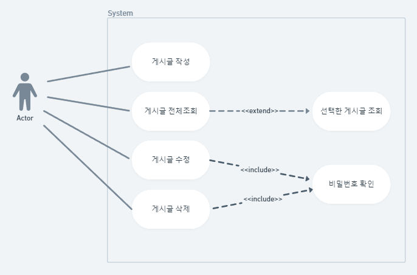
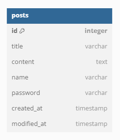

# Spring Boot CRUD API 
- [1주차][📰스파르타 게시판 API 만들기]
- [2주차][✅투두리스트 API 만들기](https://github.com/hwana/sparta-board-project/tree/second-week)

## 요구사항
### 게시글 작성 기능
- [x] `제목`, `작성자명`, `비밀번호`, `작성 내용`, `작성일`을 저장할 수 있습니다.
- [x] 저장된 게시글의 정보를 반환 받아 확인할 수 있습니다.
    - [x] 반환 받은 게시글의 정보에 `비밀번호`는 제외 되어있습니다.
### 선택한 게시글 조회 기능
- [x] 선택한 게시글의 정보를 조회할 수 있습니다.
    - [x] 반환 받은 게시글의 정보에 `비밀번호`는 제외 되어있습니다.
### 게시글 목록 조회 기능
- [x] 등록된 게시글 전체를 조회할 수 있습니다.
    - [x] 반환 받은 게시글의 정보에 `비밀번호`는 제외 되어있습니다.
- [x] 조회된 게시글 목록은 작성일 기준 내림차순으로 정렬 되어있습니다.
### 선택한 게시글 수정 기능
- [x] 선택한 게시글의 `제목`, `작성자명`, `작성 내용`을 수정할 수 있습니다.
    - [x] 서버에 게시글 수정을 요청할 때 `비밀번호`를 함께 전달합니다.
    - [x] 선택한 게시글의 `비밀번호`와 요청할 때 함께 보낸 `비밀번호`가 일치할 경우에만 수정이 가능합니다.
- [x] 수정된 게시글의 정보를 반환 받아 확인할 수 있습니다.
    - [x] 반환 받은 게시글의 정보에 `비밀번호`는 제외 되어있습니다.
### 선택한 게시글 삭제 기능
- [x] 선택한 게시글을 삭제할 수 있습니다.
    - [x] 서버에 게시글 삭제를 요청할 때 `비밀번호`를 함께 전달합니다.
    - [x] 선택한 게시글의 `비밀번호`와 요청할 때 함께 보낸 `비밀번호`가 일치할 경우에만 삭제가 가능합니다.
## Use Case Diagram

## ERDiagram

## API 명세서
[링크](https://documenter.getpostman.com/view/14625033/2s9YXfbNh2)

